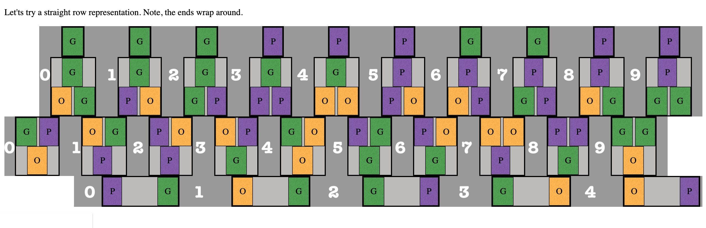

# _Concentra_ Puzzle Solution Generator # 

## Background ##

* PICTURE OF REAL PUZZLE HERE

* The _Concentra_ puzzle is designed by Dan Gilbert and made by the DaMert Company (although no longer in production) and was made in several different art styles and patterns. 

* It is an [edge-matching puzzle](http://www.robspuzzlepage.com/pattern.htm), which means that the pieces are largely interchangeable and a solved state is one where all of the pieces decorative edges align, as opposed to a jigsaw puzzle where each piece has more or less one correct spatial location. SEE LINK. Probably the most popular and largest commercial edge-matching puzzle is the [_Eternity Puzzle_](http://www.mathpuzzle.com/eternity.html) by Christopher Monckton. While _Concentra_ is much smaller, there are still trillions of possible piece permutations, of which the puzzle claims there is only a single solution ... 

* The edge matching in this puzzle is done not side to side, but from layer to layer. Each "planet" is split along an upper layer and lower layer puzzle piece. There are three total layers: 10 pieces in the first (who must match the immovable starting positions), 10 again in the next, and 5 in the final layer.

***
## Process ##

* Initially I tried solving the puzzle by hand, but after much frustration decided to use brute force to find a solution.

* For this puzzle, and many other NP-Complete edge-matching ones, that means running an exhaustive search on all possible permutations of the puzzle pieces. My process in finding all permutations--a task similar to sorting, but no way to know it's in the correct order until the last piece fits--was based off this photo: 

 HERE -ADD SOURCE

* From there I was off and running on my own (all of the linked pages I researched after developing my own solution, although they wouldn't be terribly helpful beforehand anyway). I started by numbering all of the pieces and displaying them as a straight lines that line up, rather than the original circular layout: 

* I was expecting to find one solution, but soon found 5, then 54, and now I estimate around 250 total solutions. While that sounds like a lot, it obviously is immensely dwarfed by the number of non-solution combinations. 

***
## My JavaScript Solution ##

* Based off of the straight row picture above, each piece has a number and the starting string of numbers is passed in as an array. Then, when swaps between pieces are made, this array is updated and passed to the next layer of recursion. 

* There are three main functions--one for each layer. If the first function is a success, then the second layer function is started. Then the third layer. If all three pass then it's a correct solution and the array of positions is passed to be catalogued with the other correct solutions. If not, the action goes back one layer/function and tries swapping with the next piece. 

* The reason the total number of solutions is unknown is because of the limits on the call stack size, hence the commented out sections. 

* Right now there ar two versions of the first layer function to run either the short or long version. I made this distinction because currently all of the business logic is completed by the browser (see Improvements Section for more).

***
## Visuals ##

* ACTUAL PROCESS HERE

* When the program finished the first time it output the result as a the array of piece position IDs. Wanting to test the accuracy of my result, but not wanting to place the actual puzzle pieces by their array position, I decided to add HTML and CSS for a visual display and a quicker way to check.

* Now you can see how the solutions arrange the pieces in both the true-to-real-puzzle form and in the easier to read straight row model. The controls also allow more agency to the user depending on if they're interested in seeing many solutions or just the proof of concept. 

## Related Methods ##

- **setUpButtons(solnSubset)** 

  Sets the choices of solutions to either small or large subset and updates the dropdown picker accordingly. To do so, it first deletes all preexisting options and creates and appends new options with a content and value equal to the internal index to that solution. Updates the click handler function to pass in correct subset size to called function, _displayNewSolutionHtml()_.

- **setUpControlPanel()**

  Used to control display of temporary 'small' and 'large' generate buttons, used to start the business logic (I implemented the two sizes here because I was doing all of the work browser-side, which can take a couple of minutes). This function adds eventListeners for these two buttons, which start the solving process; subsequently removes the button; enables the radio button to toggle the dropdown picker; and checks to remove original container div if both buttons have been pressed. The 'large' button receives the same click handler, except that it also gives an alert/confirm message before executing, notifying the user of the upcoming delay.

- **radioSubsetSmall.addEventListener()** 

  Adds handlers to small (and large) radio buttons to switch dropdown selection and call _setUpButtons()_. Although both radio buttons are disabled at the beginning until the corresponding 'generate' button is clicked.

- **setUpDOMPropertyArr() / setUpDOMPropertyArrCircle()**

  Both of these functions are used to link the internal array of puzzle pieces, _arrPuzzlePieces_ to specific DOM elements. These connections stay the same throughout the rest of the session. When a new solution is loaded in, the connections remain, but the _arrPuzzlePieces_ pieces's letters and colors are updated to the order of pieces in the newly displayed solution.

***
## Future Improvements ##

* My future improvements for this project would be to add server-side logic. That way the business logic could be completed behind the scenes and preferably just once. Then the frontend could send a GET request to an endpoint and receive an array of all the solutions in JSON format. 

* The other major change would be to make an Angular version of this. Angular's structural directives would greatly reduce the current redundancy in the HTML code. Besides other small improvements, I'd add Angular Material to take advantage of the Drag and Drop feature. Then, much like the stopwatch in my Conway's Game of Life project, the pieces could be manually dragged around by the user to try and solve the puzzle on their own.

* The final change I forsee is adding the ability to switch between several different puzzle designs. The _Concentra_ puzzle came in several different themes--ancient coins, planets, etc.--and by adding this, I think the solution generator would be applicable to a more general, wider audience.

