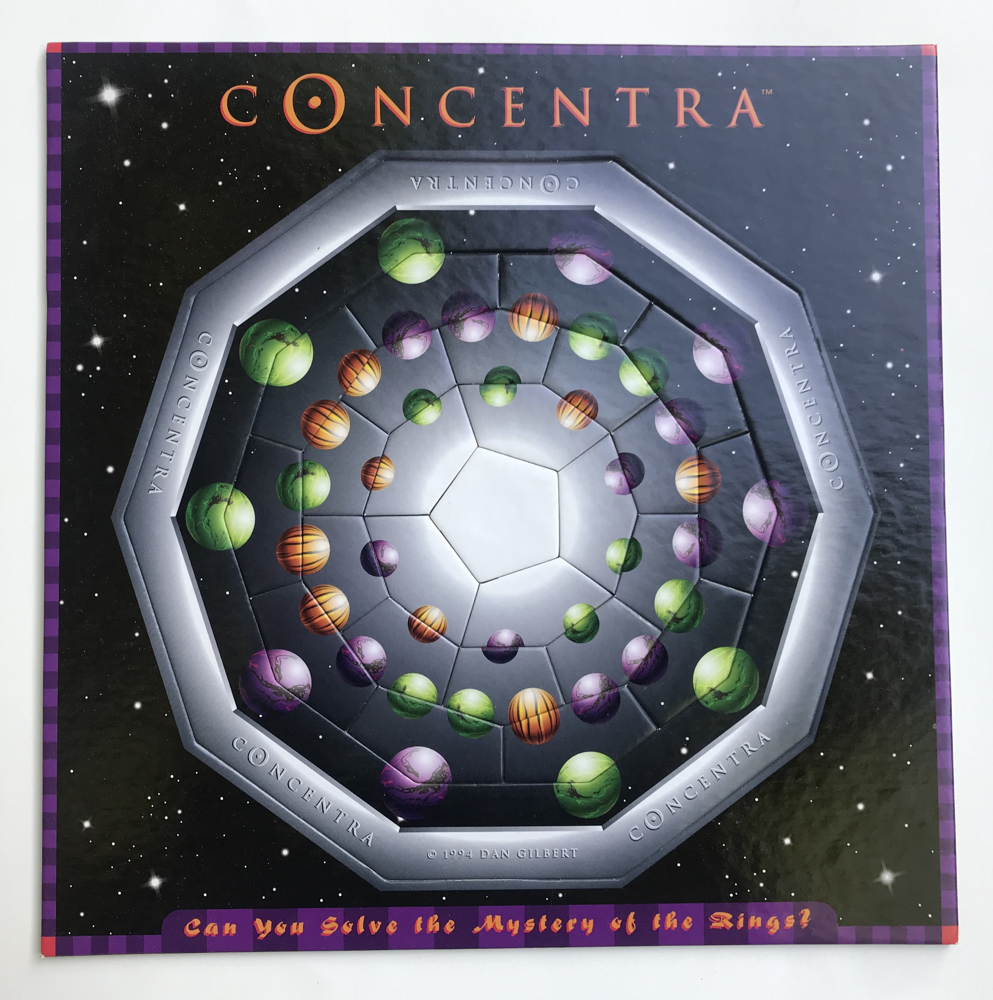
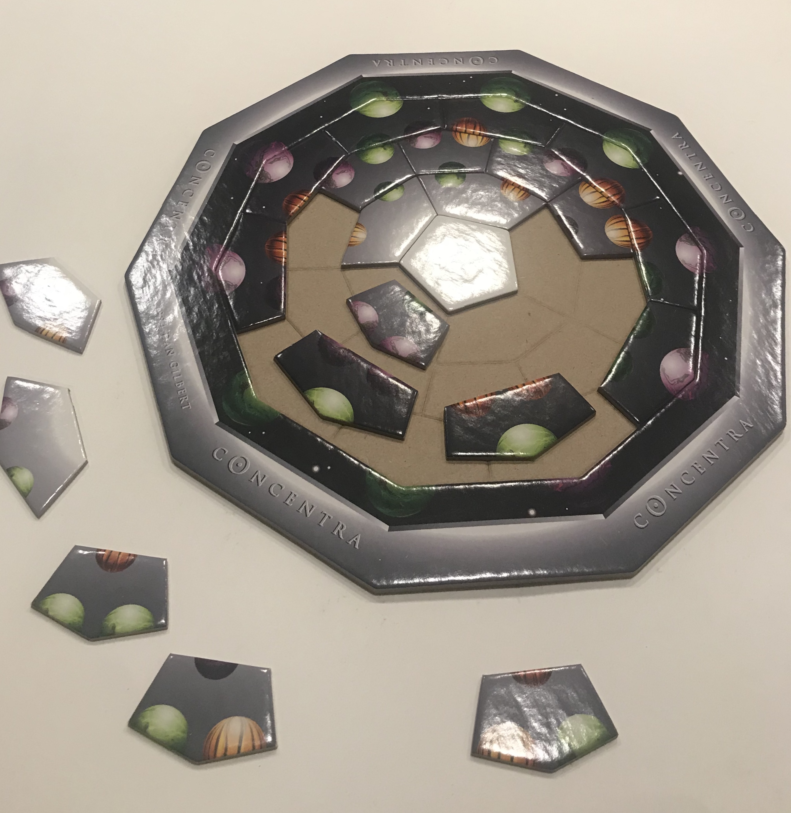

# _Concentra_ Puzzle Solution Generator # 

## Background ##

* The _Concentra_ puzzle is designed by Dan Gilbert and was made by the DaMert Company (although no longer in production) and was produced in several different art styles and patterns. 

* It is an [edge-matching puzzle](http://www.robspuzzlepage.com/pattern.htm), which means that the pieces are largely interchangeable and a solved state is one where all of the pieces decorative edges align, as opposed to a jigsaw puzzle where each piece has more or less one correct spatial location. Probably the most popular and largest commercial edge-matching puzzle is the [_Eternity Puzzle_](http://www.mathpuzzle.com/eternity.html) by Christopher Monckton. While _Concentra_ is much smaller, there are still trillions of possible piece permutations, of which the puzzle claims there is only a single solution ... 

* The edge matching in this puzzle is done not side to side, but from layer to layer. Each "planet" is split along an upper layer and lower layer puzzle piece. There are three total layers: 10 pieces in the first (which must match the immovable starting positions), 10 again in the next, and 5 in the final layer.

***
## Process ##

* Initially I tried solving the puzzle by hand, but after a week's frustration decided to use brute force to find a solution.

* For this puzzle, and many other NP-Complete edge-matching ones, that means running an exhaustive search on all possible permutations of the puzzle pieces. My process in finding all permutations--a task similar to sorting, but with no way to know it's a possible solution until the last piece fits--was kickstarted by this photo: 

(image source: https://www.techiedelight.com/generate-permutations-string-java-recursive-iterative/)

* From there I was off and running on my own (all of the linked pages I researched after developing my own solution, although they wouldn't be terribly helpful beforehand anyway). I started by numbering all of the pieces (i.e., their indexes) and displaying them as a straight lines where the pieces correctly align, rather than the original circular layout. Note: the very top row doesn't have numbers because they are the immovable starting positions, not actual pieces.

* I was expecting to find just one solution, but soon found 5 solutions, and have now concluded that there is a total of 63 unique solutions. While that sounds like a lot, it obviously is immensely dwarfed by the number of non-solution combinations. 

***
## My JavaScript Solution ##

* Based off of the straight row picture above, the starting order of pieces is passed in as an array of their indexes. Then, when swaps between pieces are made, this array is updated and passed to the next layer of recursion using the spread operator.

* There are three main functions--one for each layer. If the first function is a success then the second layer function is started; then the third layer. If all three pass then it's a correct solution and the array of piece positions/indexes is passed to be catalogued with the other correct solutions. If not, the action goes back one layer/function and tries swapping with the next piece. 

* While the controls on the webpage allow the user to select either the 'small' or 'large' solutions subset, the JavaScript operations in the background are the same for either. The different subsets are created when the dropdown options are created (see _setUpButtons()_ in **Visuals Section**).

### Methods ###

* **Puzzle Piece Arrays**

  There are two arrays to store the different puzzle pieces: _arrPuzzlePieces_ and _bankAvlblPuzzlePieces_. The first one is used to connect the HTML visuals to the to-be-displayed solution and thus this array sees a lot less action. The second array is used all throughout the solution(s) search. Both are nested arrays of size four, where each interior array corresponds to the puzzle pieces for one layer. 

* **fitsRowOne(), fitsRowTwo(), fitsRowThree()** 

  These three functions, one for each layer, take an index and a puzzle piece to determine if the piece fits there. Each piece can have up to three colors/letters on it and the _fitsRowNum()_ functions compare each of these three colors/letters to the correct spot in the row above or below (i.e., the colors/letters must match).

*  **switchRow()** 

    This function takes three parameters: index to switch to (_switchSpotIdx_), index of piece to switch in (_toSwitchInIdx_), and row number. It is called twice from each _row#Perm()_ function, once to reset the array of pieces to the working copy and twice to actually switch the next piece. This second switch is not undone until that permutation is deemed a non-solution. 

* **row1Perm(), row2Perm(), row3Perm()**

  These functions are the heart of the program. They take care of recursively generating all of the permutations. Once _row1Perm_ is completed successfully, it in turn calls _row2Perm_. If all of the puzzle pieces align in that row, then the final _row3Perm_. If _row3Perm_ is a success, then that ordering of puzzle pieces is a solution and it is sent off to _cementSolvedArray_ to be catalogued. If at any point there is not a puzzle piece to fit the current switch-in-spot, then that permutation is not a solution and the searching process is returned back up the tree to the previous branch. This could mean the next ordering is in the same row, the previous row, or all the way back in the first row.

  These functions are passed three parameters: the switch spot index (_switchSpot_), the piece-to-be-switched index (_toSwitchIn_), and the array of the working solution copy (_simpleNumArray_). When provisionary switches are made, they are recorded in this array where each puzzle piece is represented by its index. If a solution is fails at any point, the working copy, _simpleNumArray_, is restored to its last potential point in the next function (execution context).

  There are four main steps to the function:

  1. Restore _bankAvlblPuzzlePieces_ to _simpleNumArray_ by making necessary switches. 

  2. If _switchSpot_ and _toSwitchIn_ are equal, the current row function is called to try ALL unused pieces in the current _switchSpot_. Importantly, this is performed before the current, non-restorative switch is made.

  2. Checks if piece actually fits. 
  
      * Perform the switch if piece not already in place.

      * If _switchSpot_ is at penultimate spot for row and the last piece fits too, then call the next _row#Perm()_ function (e.g., from _row1Perm()_ to _row2Perm()_). Also set _hasAvlblBranches_ to false.

      * If piece does not fit, set _hasAvlblBranches_ to false.

  3. Checks if _hasAvlblBranches_ is true, meaning lower branches of permutations where the current piece fits will continue to be explored. It does so by increasing the _switchSpot_ by one; setting _toSwitchIn_ equal to it; and calling the current _row#Perm()_ function for each unused puzzle piece.

* **cementSolvedArray()**

  This function comes at the very end of a successful solution process and creates a new, temporary array to store the solution from the working copy in _bankAvlblPuzzlePieces_. It pushes all of these solutions into one array called _allSolvedPuzzlePieces_. If this array is empty it pushes the current solution immediately. Otherwise it first confirms that the solution is not a duplicate before pushing.

***
## Visuals ##

* When the program finished the first time it output the result as a the array of piece position IDs. Wanting to test the accuracy of my result, but not wanting to place the actual puzzle pieces by their array position, I decided to add HTML and CSS for a visual display and a quicker way to check.

* Now the user can see how the solutions arrange the pieces in both the true-to-real-puzzle form and in the easier to read straight row model. The controls also allow more agency to the user depending on if they're interested in seeing all of the solutions or just the proof of concept (i.e., 6 solutions displayed). 

### Related Methods ###

- **setUpButtons(solnSubset)** 

  Sets the choices of solutions to either small or large subset and updates the dropdown picker accordingly. To do so, it first deletes all preexisting options and creates and appends new options with a content and value equal to the internal index to that solution. Updates the onchange function to call _displayNewSolutionHtml()_ with the selected solution id.

- **setUpControlPanel()**

  Used to control display of temporary 'Generate Solutions' button, which starts the solution finding process. After this button is clicked it is removed from the DOM/display and enables both of the below radio buttons for picking solution subset size.

- **radioSubsetSmall.addEventListener()** 

  Adds handlers to small (and large) radio buttons to switch dropdown selection and call _setUpButtons()_. Although both radio buttons are disabled at the beginning until the 'Generate Solutions' button is clicked.

- **setUpDOMPropertyArr() / setUpDOMPropertyArrCircle()**

  Both of these functions are used to link the internal array of puzzle pieces, _arrPuzzlePieces_, to specific DOM elements. These connections stay the same throughout the rest of the session. When a new solution is loaded in, the connections remain, but the _arrPuzzlePieces_ pieces's letters and colors are updated to the order of pieces in the newly displayed solution.

***
## Future Improvements ##

* My future improvements for this project would be to add server-side logic. That way the business logic could be completed behind the scenes and preferably just once. Then the frontend could send a GET request to an endpoint and receive an array of all the solutions in JSON format. However, the current calculations on the browser-side are very quick, so this would be more of a good practice change than a logistical one.

* The other major change would be to make an Angular version of this. Angular's structural directives would greatly reduce the current redundancy in the HTML and CSS code. Besides other small improvements, I'd add Angular Material to take advantage of the Drag and Drop feature. Then, much like the stopwatch in my Conway's Game of Life project, the pieces could be manually dragged around by the user to try and solve the puzzle on their own.

* The final change I foresee is adding the ability to switch between several different puzzle designs. The _Concentra_ puzzle came in several different themes--ancient coins, planets, etc.--and by adding this, I think the solution generator would be applicable to a more general, wider audience.

***
## Attributions ##

The background image of purple puzzle pieces is a SVG pattern created by Steve Schoger, as found on his website [Hero Patterns](http://www.heropatterns.com/), CC 4.0.